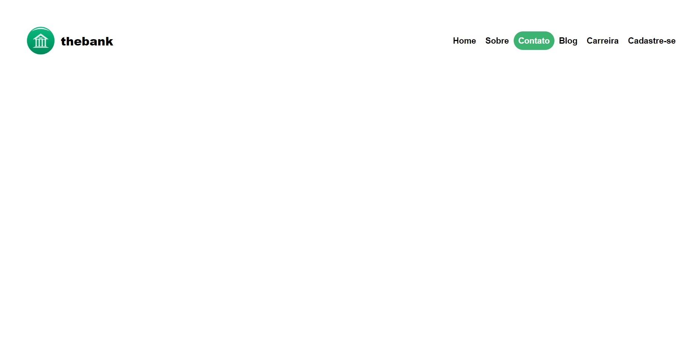

<h1 align="center">
  Projeto The bank
</h1>

<b>Desktop Preview</b> 🖥️ 💻

  

  <a href="#-tecnologias">Tecnologias</a>&nbsp;&nbsp;&nbsp;|&nbsp;&nbsp;&nbsp;
  <a href="https://prof-danielcorrea.github.io/thebank">Projeto</a>&nbsp;&nbsp;&nbsp;|&nbsp;&nbsp;&nbsp;

 

## 🚀 Tecnologias:

Esse projeto foi utilizado objetivando o aprendizado dos alunos da disciplina de Desenvolvimento Web (turma 224/2023), foi utilizado as seguintes tecnologias abaixo:

- HTML5
- CSS3

## 📚 Conhecimentos colocados em prática:

- Tags (link, img, header, nav)
- Listas ordenadas e não ordenadas
- seletores
- Propriedade Flexbox
- Media queries 

## 🚧 Projeto:

Link do Projeto: [The bank](https://prof-danielcorrea.github.io/thebank/)

---

Feito por Daniel Correa
